

  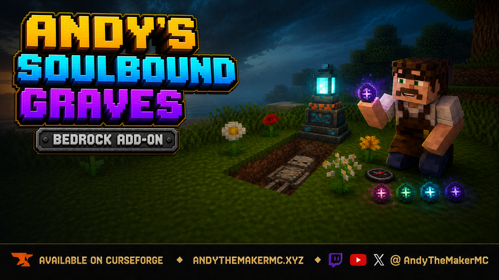

# Andy's Soulbound Graves

**Bind your inventory beyond death in Minecraft Bedrock.**

Carry a tiered Soulbound Rune in your off-hand and a protected death becomes a physical gravesite: your inventory is secured inside buried skeleton remains, a Soul Lantern marks the tombstone, and a native Recovery Compass guides you back. Dig up the grave and present its matching compass to recover every stored stack safely.

  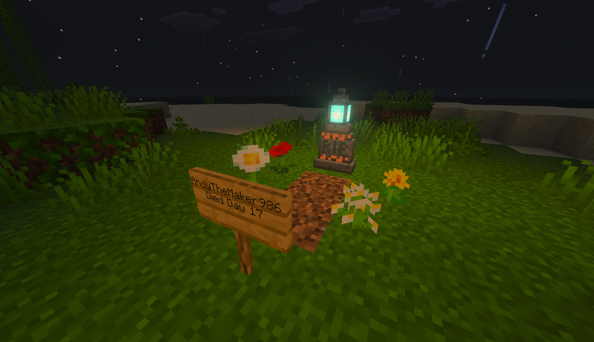

_A complete Overworld gravesite marks the burial plot and records the owner and Minecraft death day._

**Current release:** 0.1.36  
**Download:** [Andys_Soulbound_Graves_0.1.36.mcaddon](Andys_Soulbound_Graves_0.1.36.mcaddon)  
**SHA-256:** `0D12583FDD2C1B430916DFAB11AD7C8445A7916C03B30D35A0E2F5D514E2F7A8`

Minecraft Bedrock **26.30 or newer** is required. Both linked packs must be active. No cheats, commands, experimental gameplay toggles, or additional dependencies are required. Standard graphics and Vibrant Visuals are supported.

The complete player documentation is in the [GitHub Wiki](https://github.com/CharlesJGantt/Andys-Soulbound-Graves/wiki).

## Features

- Four Soulbound Rune tiers with 3, 6, 9, and unlimited successful uses
- Intentional off-hand requirement that competes with shields, maps, and totems
- Physical 1 × 3 graves with a Soul Lantern, coarse dirt, sign, environmental flora, and buried remains
- Complete player inventory stored inside a prone skeleton rather than a chest
- Updated rune stored and recovered with the rest of the owner's possessions
- Native Recovery Compass bound to one grave, with direction, distance, vertical, dimension, and timer guidance
- Atomic recovery that refuses to consume the compass or clear the grave unless every stored stack can be returned safely
- Multiple active graves without a newer death replacing an older one
- Optional 20/40/60-minute Timed Soulbinding progression, disabled by default
- Wither Rose ritual for reactivating expired remains without deleting stored items
- Memorial, immediate removal, permanent, and timed memorial post-recovery modes
- Tier I–III recharge at an anvil with an Amethyst Cluster
- Protected tombstones, signs, plots, and remains with owner/operator management
- Twenty-four PBR-ready tombstone combinations across stone, deepslate, and diorite
- Overworld, Nether, End, underwater, and Tier IV lava grave handling
- Graves on soul sand, soul soil, and other solid ground
- Held rune uses the same inventory icon in hand
- World settings from the Behavior Pack gear menu or the in-game operator form
- Standard graphics and Vibrant Visuals support
- Single-player, multiplayer, Realms, and compatible servers

## Rune progression

| Rune | Visual color | Uses | Timer when enabled | Special protection |
| --- | --- | ---: | ---: | --- |
| Tier I | Magenta | 3 | 20 minutes | Normal and submerged graves |
| Tier II | Emerald green | 6 | 40 minutes | Normal and submerged graves |
| Tier III | Diamond cyan | 9 | 60 minutes | Normal and submerged graves |
| Tier IV | Purple | Unlimited | Unlimited | Adds a solid protective vault for lava deaths |

Timed Soulbinding is off by default, so all protected graves remain recoverable indefinitely unless an operator enables it.

## Recipes

### Soulbound Rune I

| Crying Obsidian | Amethyst Shard | Obsidian |
| --- | --- | --- |
| Amethyst Shard | Diamond | Amethyst Shard |
| Obsidian | Amethyst Shard | Crying Obsidian |

The recipe unlocks when an Amethyst Shard is first obtained.

  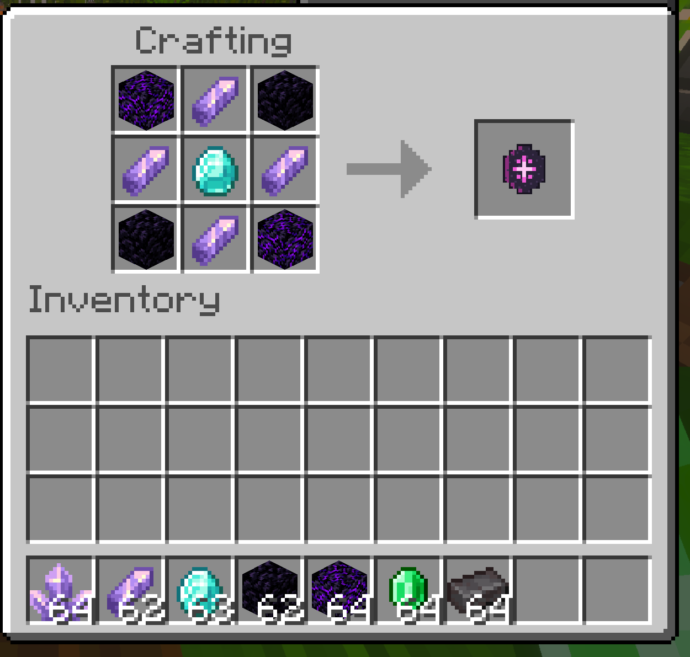

### Upgrades

- **Tier II:** Tier I rune surrounded by eight Emeralds

  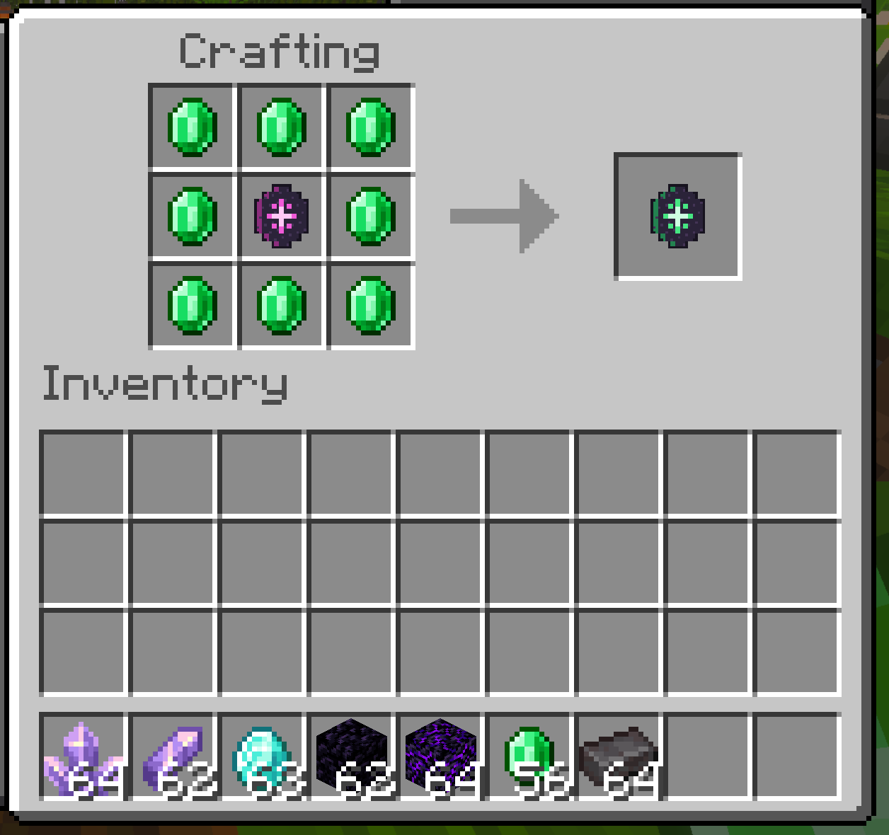

- **Tier III:** Tier II rune surrounded by eight Diamonds

  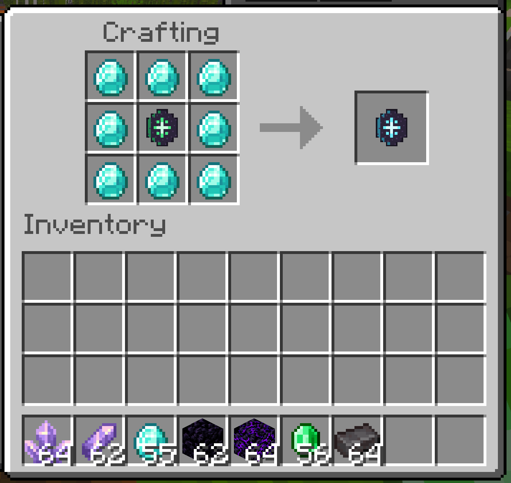

- **Tier IV:** Tier III rune surrounded by eight Netherite Ingots

  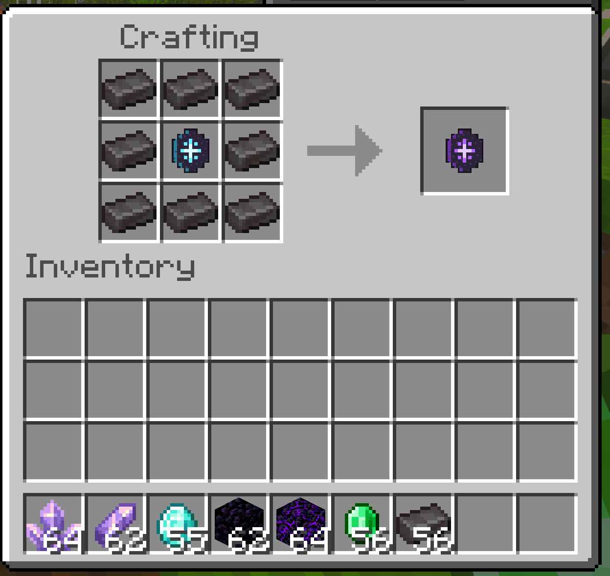

To recharge Tier I–III, carry an **Amethyst Cluster**, hold a partially depleted rune, and crouch-interact with a normal, chipped, or damaged Anvil. One cluster restores one use.

## Protected-death and recovery loop

1. Put a usable Soulbound Rune in the off-hand/shield slot before death.
2. Die in a supported location.
3. Respawn and receive that grave's Soulbound Recovery Compass.
4. Hold the compass and follow its action-bar guidance.
5. Locate the tombstone and dig through the coarse dirt.
6. Hold the matching compass and interact with the exposed skeleton.
7. Make inventory room if prompted; restoration completes only when every stored stack is safe.

The rune loses one use only after a grave transaction succeeds, then rests inside the skeleton with the inventory. Experience follows vanilla death behavior.

  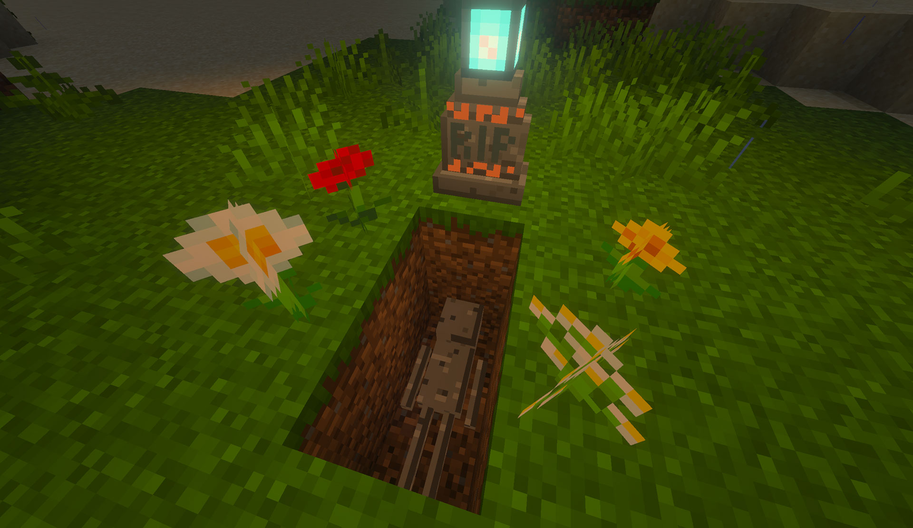

_Dig through the grave plot to expose the prone skeleton—the remains are the protected inventory storage, not the tombstone._

Void deaths are not protected. Lava deaths require Tier IV.

## Graves across dimensions

  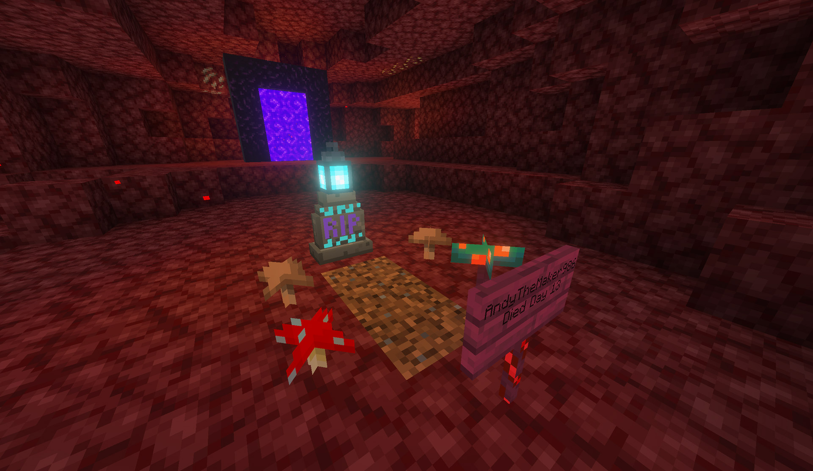

  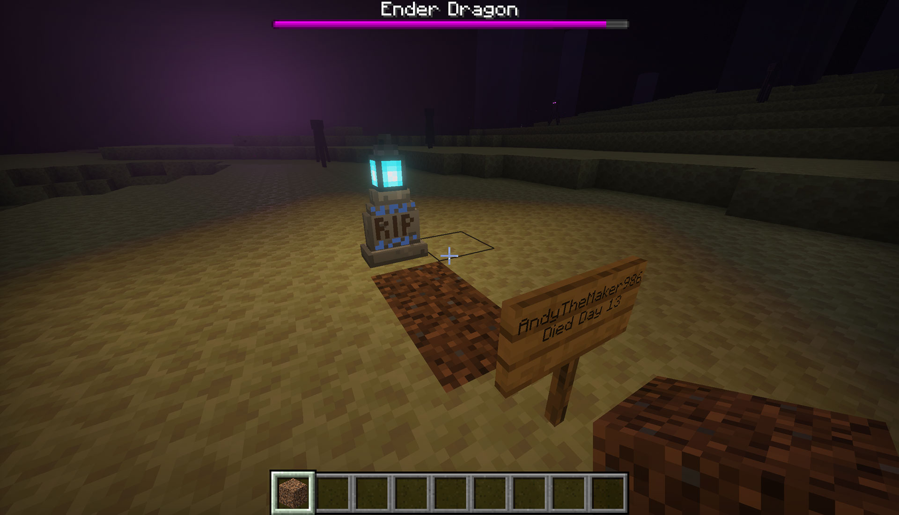

  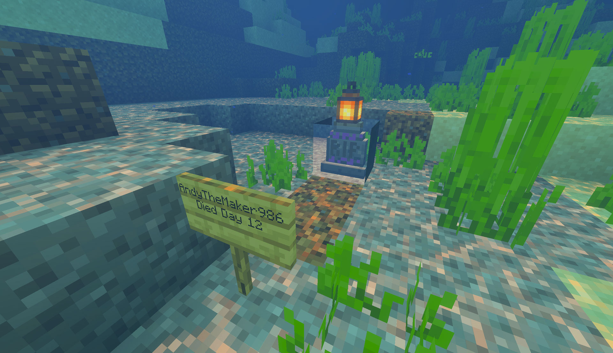

  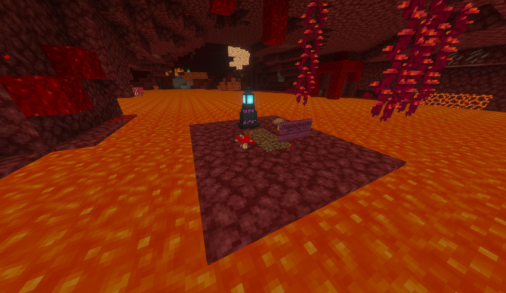

_Tier IV can secure a lava death by creating a solid, dimension-appropriate grave vault before placing the burial scene._

## World settings

Operators can configure timers and post-recovery behavior from either:

- The Behavior Pack gear icon in the world editor
- Crouch-using a Soulbound Rune in the main hand in-game

- Timed Soulbinding on/off
- Owner-online or world-running timer behavior
- Memorial, remove, permanent, or timed memorial post-recovery behavior
- Timed memorial duration

  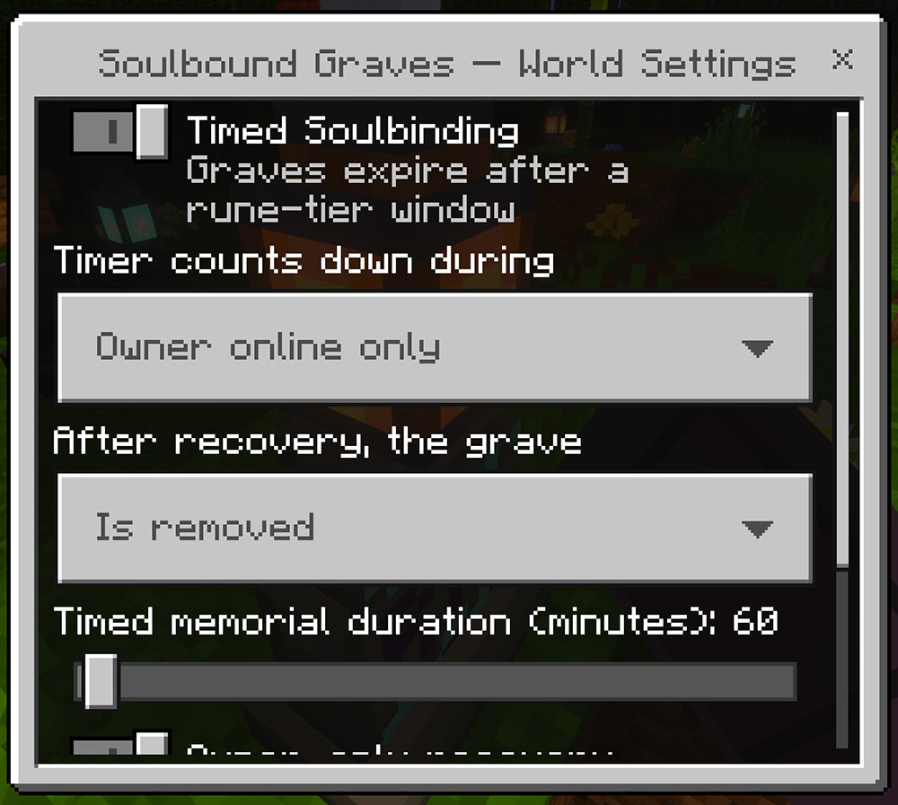

_Operators configure timers and post-recovery grave behavior from the pack gear menu or an in-game form—no commands or experimental gameplay toggles required._

Existing graves keep the timer window they received at creation.

The owner or an operator can crouch-interact with a tombstone to inspect it. Removal stays locked while possessions remain bound.

  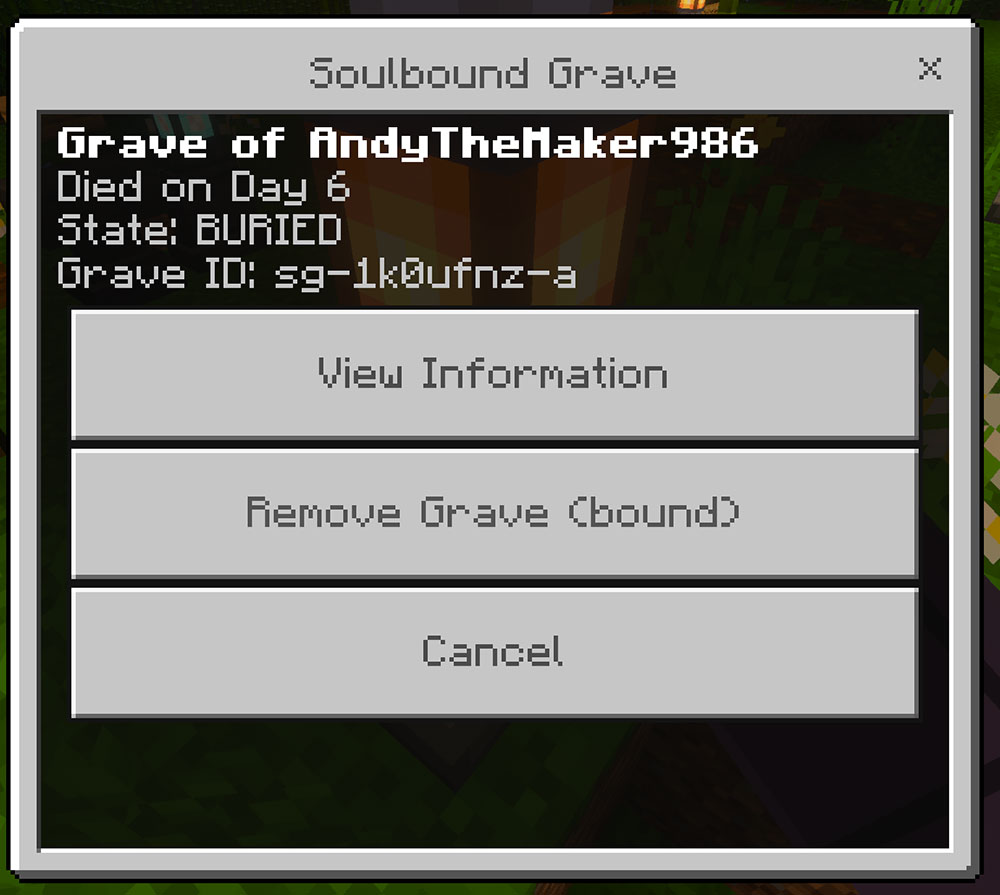

_The owner or an operator can inspect a grave, but the removal action stays locked while possessions remain bound._

## Installation

### Windows, Android, iPhone, and iPad

1. Download [Andys_Soulbound_Graves_0.1.36.mcaddon](Andys_Soulbound_Graves_0.1.36.mcaddon).
2. Open it with Minecraft Bedrock and wait for both packs to import.
3. Create or edit a world.
4. Activate **Andy's Soulbound Graves [BP]** under Behavior Packs.
5. Confirm **Andy's Soulbound Graves [RP]** is active under Resource Packs.
6. Enter the world and obtain an Amethyst Shard to unlock the first rune recipe.

Back up an important world before installing or updating any add-on.

### Xbox, PlayStation, and Nintendo Switch

Import and activate the add-on on Windows or mobile, upload the prepared world to a Realm, and join that Realm from the console.

## Compatibility and limitations

- Minecraft Bedrock 26.30+
- Stable Script APIs only
- Both linked packs required at the same version
- Standard graphics and Vibrant Visuals/PBR
- Single-player, multiplayer, Realms, and compatible Bedrock servers
- No cheats, commands, experimental toggles, or required dependencies
- Void deaths are ordinary vanilla loss
- Tier I–III do not protect lava deaths
- Experience is not stored
- Third-party death, inventory, grave, equipment, and keep-inventory systems may conflict

See [Compatibility and Troubleshooting](https://github.com/CharlesJGantt/Andys-Soulbound-Graves/wiki/Compatibility-and-Troubleshooting) for detailed diagnostics.

## Keep Exploring with Andy

If Soulbound Graves saved your gear—or simply made death a little more memorable—visit [AndyTheMakerMC.xyz](https://AndyTheMakerMC.xyz) for more Minecraft Bedrock add-ons, `.mcstructure` downloads, HoloPrint files, world lore, tutorials, guides, videos, and other creations.

## Join the Community

Follow **@AndyTheMakerMC** for new releases, development updates, tutorials, showcases, streams, and more Minecraft adventures on [YouTube](https://www.youtube.com/@AndyTheMakerMC), [Twitch](https://twitch.tv/AndyTheMakerMC), [X](https://x.com/AndyTheMakerMC), [TikTok](https://www.tiktok.com/@AndyTheMakerMC), and [Instagram](https://www.instagram.com/AndyTheMakerMC).

## Help Bring More Add-ons to Life

Ratings, favorites, recommendations, and kind comments all help other Bedrock players discover Andy's work. If you would also like to support future projects, you can contribute through [Ko-fi](https://ko-fi.com/andythemaker) or make a [direct Stripe contribution](https://buy.stripe.com/4gM4gz0qu0xwgxw0IfcMM00). Every bit of support is appreciated, but it is never required.

## Player, server, Realm, and content-creator permission

Players may use an official, unmodified release in personal worlds, multiplayer worlds, Realms, and compatible servers. Minecraft's normal delivery of the official, unmodified add-on to joining players is permitted.

Content creators may use, review, and showcase an official, unmodified release in original gameplay videos, livestreams, screenshots, tutorials, reviews, showcases, articles, guides, social posts, and other original content, including monetized content. Credit to **AndyTheMakerMC** and a link to the official project page are appreciated whenever practical.

These permissions do not allow the add-on file to be offered separately or any project content to be modified, translated, adapted, extracted, mirrored, rehosted, resold, bundled, repackaged, redistributed, or reused.

## All Rights Reserved

**All Rights Reserved. Copyright © 2026 Andy / AndyTheMakerMC.**

See [LICENSE.md](LICENSE.md) for the complete license and permitted-use terms.

The promotional artwork is original AI-assisted concept artwork directed for this project. It is not an in-game screenshot.

Minecraft is a trademark of Microsoft Corporation. This project is not affiliated with, endorsed by, sponsored by, or associated with Microsoft or Mojang Studios.
